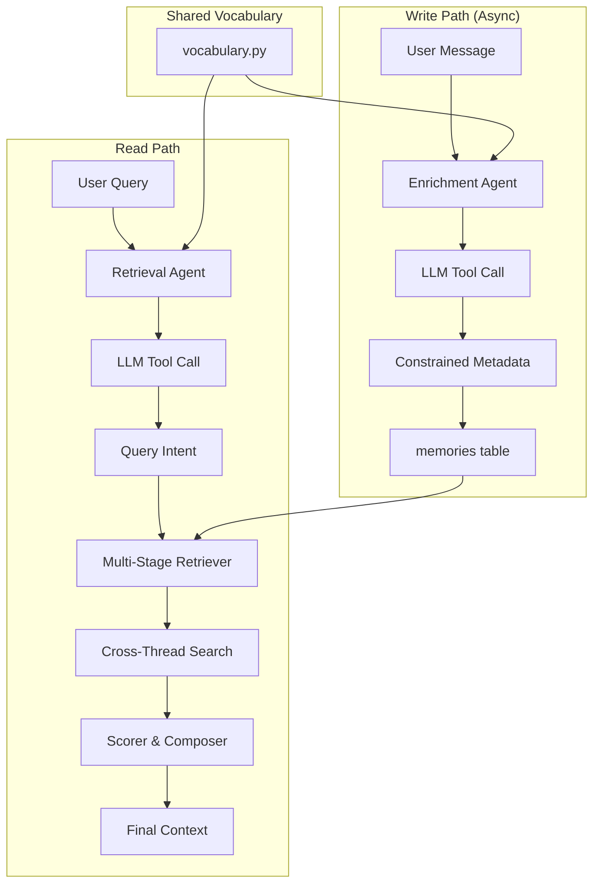

# MindCore: Context Assembly Intelligence Layer

## The Problem: From Rows to Context

Traditional approach fetches everything:
```sql
-- BAD: Gets everything, huge context window waste
SELECT * FROM memories WHERE user_id = 'U-123';  
-- Returns 10,000 rows, 500KB of data, 95% irrelevant
```

MindCore's intelligent approach:
```sql
-- SMART: Multi-stage filtering with controlled vocabulary
-- Returns 10-20 most relevant memories, 5KB of data, 95% relevant
-- Exact matches guaranteed via shared vocabulary
```

---

## Core Design Principle: Shared Vocabulary

Both the **Enrichment Agent** (writes metadata) and **Retrieval Agent** (queries metadata) use the same controlled vocabulary. This eliminates semantic drift and enables fast, deterministic queries.

**Critical:** Both agents use LLM with native tool calling - no keyword matching or regex-based classification. Keywords cause false positives and lose semantic meaning in context.

```python
# vocabulary.py - Single source of truth
VOCABULARY = {
    'version': '2024-01-15',
    
    'topics': [
        'refund',
        'shipping',
        'account_access',
        'billing',
        'product_issue',
        'cancellation',
        'order_status',
        'payment',
        'returns',
        'technical_support',
        'pricing',
        'subscription',
        'general_inquiry',  # Catch-all for unclear intent
    ],
    
    'categories': [
        'support_request',
        'complaint',
        'inquiry',
        'feedback',
        'transaction',
        'escalation',
        'conversation',  # General conversation, not action-oriented
    ],
    
    'message_types': [
        'question',
        'statement',
        'request',
        'confirmation',
        'follow_up',
        'clarification',
    ],
    
    'entity_types': [
        'order_id',
        'product_name',
        'person_name',
        'date',
        'amount',
        'tracking_number',
        'email',
        'phone',
    ]
}
```

---

## Context Assembly Architecture



---

## Metadata Schema

```python
# Every memory has this structure
metadata = {
    # Constrained fields - MUST be from vocabulary
    'topics': ['refund', 'billing'],      # 1-3 from VOCABULARY['topics']
    'category': 'support_request',         # 1 from VOCABULARY['categories']
    'message_type': 'question',            # 1 from VOCABULARY['message_types']
    
    # Extracted entities with type tags
    'entities': [
        {'type': 'order_id', 'value': '#1234'},
        {'type': 'amount', 'value': '$99.00'}
    ],
    
    # Confidence tracking for vocabulary improvement
    'confidence': 'high',                  # high | medium | low
    'suggested_topic': None,               # Populated only if confidence=low
    'suggested_category': None,
    
    # Standard fields
    'importance': 0.7,                     # 0.0 - 1.0
    'role': 'user',                        # user | assistant | system
    
    # Audit
    'vocabulary_version': '2024-01-15',
    'enrichment_model': 'gpt-4o-mini'
}
```

---

## Stage 1: Enrichment Agent (Write Path)

```python
from openai import OpenAI

class EnrichmentAgent:
    """
    Assigns metadata using controlled vocabulary via OpenAI tool calling.
    Runs async after message is stored - not in critical path.
    
    Uses gpt-4o-mini with native tool calling for structured output.
    LLM understands semantic meaning - no keyword matching.
    """
    
    def __init__(self, vocabulary: dict):
        self.vocabulary = vocabulary
        self.client = OpenAI()
        self.tools = self._build_tools()
    
    def _build_tools(self) -> list:
        """Build tool definitions with vocabulary as enums"""
        return [
            {
                "type": "function",
                "function": {
                    "name": "classify_message",
                    "description": "Classify a message with topics, category, and entities. "
                                   "Understand the semantic INTENT of the message, not just keywords. "
                                   "For example, 'I'm not here for a refund, I need understanding' "
                                   "should be classified as 'general_inquiry', NOT 'refund'.",
                    "parameters": {
                        "type": "object",
                        "properties": {
                            "topics": {
                                "type": "array",
                                "items": {
                                    "type": "string",
                                    "enum": self.vocabulary['topics']
                                },
                                "minItems": 1,
                                "maxItems": 3,
                                "description": "1-3 topics that represent the INTENT of the message. "
                                               "Focus on what the user WANTS, not words they mention."
                            },
                            "category": {
                                "type": "string",
                                "enum": self.vocabulary['categories'],
                                "description": "Single category that best describes the PURPOSE of this message."
                            },
                            "message_type": {
                                "type": "string",
                                "enum": self.vocabulary['message_types'],
                                "description": "Type of message"
                            },
                            "entities": {
                                "type": "array",
                                "items": {
                                    "type": "object",
                                    "properties": {
                                        "type": {
                                            "type": "string",
                                            "enum": self.vocabulary['entity_types']
                                        },
                                        "value": {"type": "string"}
                                    },
                                    "required": ["type", "value"]
                                },
                                "description": "Extracted entities - order IDs, amounts, names, etc."
                            },
                            "importance": {
                                "type": "number",
                                "minimum": 0.0,
                                "maximum": 1.0,
                                "description": "Importance: 0.0-0.3 casual, 0.4-0.6 normal, 0.7-1.0 critical"
                            },
                            "confidence": {
                                "type": "string",
                                "enum": ["high", "medium", "low"],
                                "description": "How confident are you in this classification?"
                            },
                            "suggested_topic": {
                                "type": ["string", "null"],
                                "description": "If no topic fits well, suggest a new one"
                            },
                            "suggested_category": {
                                "type": ["string", "null"],
                                "description": "If no category fits well, suggest a new one"
                            }
                        },
                        "required": ["topics", "category", "message_type", "confidence", "importance"]
                    }
                }
            }
        ]
    
    def enrich(self, message: str, role: str = "user") -> dict:
        """
        Classify message using tool calling.
        Returns validated metadata dict.
        """
        response = self.client.chat.completions.create(
            model="gpt-4o-mini",
            messages=[
                {
                    "role": "system",
                    "content": (
                        "Classify the message by its semantic INTENT, not by keywords present. "
                        "Example: 'I don't want a refund, I want to understand the policy' "
                        "→ topic should be 'general_inquiry', NOT 'refund'. "
                        "The user explicitly said they DON'T want a refund. "
                        "Always consider negations and context."
                    )
                },
                {"role": "user", "content": message}
            ],
            tools=self.tools,
            tool_choice={"type": "function", "function": {"name": "classify_message"}}
        )
        
        # Extract tool call arguments
        tool_call = response.choices[0].message.tool_calls[0]
        metadata = json.loads(tool_call.function.arguments)
        
        # Add audit fields
        metadata['role'] = role
        metadata['vocabulary_version'] = self.vocabulary['version']
        metadata['enrichment_model'] = 'gpt-4o-mini'
        
        return metadata
```

---

## Stage 2: Retrieval Agent (Read Path - Query Analysis)

```python
from openai import OpenAI

class RetrievalQueryAnalyzer:
    """
    Analyzes user query to extract search parameters.
    Uses same vocabulary as enrichment for exact matching.
    
    ALWAYS uses LLM tool calling - no keyword matching.
    LLM understands semantic intent and negations.
    """
    
    def __init__(self, vocabulary: dict):
        self.vocabulary = vocabulary
        self.client = OpenAI()
        self.tools = self._build_tools()
    
    def _build_tools(self) -> list:
        """Build tool definition with vocabulary constraints"""
        return [
            {
                "type": "function",
                "function": {
                    "name": "extract_search_params",
                    "description": "Extract search parameters from user query. "
                                   "Understand semantic INTENT, not keywords. "
                                   "Consider negations: 'not about refunds' means EXCLUDE refund topic.",
                    "parameters": {
                        "type": "object",
                        "properties": {
                            "topics": {
                                "type": "array",
                                "items": {
                                    "type": "string",
                                    "enum": self.vocabulary['topics']
                                },
                                "maxItems": 3,
                                "description": "Topics to search for based on user's INTENT"
                            },
                            "category": {
                                "type": ["string", "null"],
                                "enum": self.vocabulary['categories'] + [None],
                                "description": "Category filter if clearly applicable"
                            },
                            "time_scope": {
                                "type": "string",
                                "enum": ["today", "yesterday", "last_week", "last_month", "all"],
                                "description": "Time range for search"
                            },
                            "entities": {
                                "type": "array",
                                "items": {
                                    "type": "object",
                                    "properties": {
                                        "type": {
                                            "type": "string",
                                            "enum": self.vocabulary['entity_types']
                                        },
                                        "value": {"type": "string"}
                                    },
                                    "required": ["type", "value"]
                                },
                                "description": "Specific entities to search for (order IDs, names, amounts)"
                            },
                            "search_current_thread_only": {
                                "type": "boolean",
                                "description": "True if query is about current conversation only. "
                                               "False if user wants to search across all their history."
                            }
                        },
                        "required": ["topics", "time_scope", "search_current_thread_only"]
                    }
                }
            }
        ]
    
    def analyze(self, query: str, thread_context: str = None) -> QueryIntent:
        """
        Analyze query using LLM tool calling.
        
        Args:
            query: User's query string
            thread_context: Optional recent messages for context
        
        Returns:
            QueryIntent with topics, entities, time_scope, cross_thread flag
        """
        messages = [
            {
                "role": "system",
                "content": (
                    "Extract search parameters from the query. "
                    "Understand the semantic INTENT - what does the user actually want to find? "
                    "If they reference past conversations or history, set search_current_thread_only=false. "
                    "If they ask about 'this conversation' or recent context, set it to true."
                )
            }
        ]
        
        if thread_context:
            messages.append({
                "role": "user",
                "content": f"Recent conversation context:\n{thread_context}\n\nUser query: {query}"
            })
        else:
            messages.append({"role": "user", "content": query})
        
        response = self.client.chat.completions.create(
            model="gpt-4o-mini",
            messages=messages,
            tools=self.tools,
            tool_choice={"type": "function", "function": {"name": "extract_search_params"}}
        )
        
        # Extract tool call arguments
        tool_call = response.choices[0].message.tool_calls[0]
        data = json.loads(tool_call.function.arguments)
        
        # Convert time_scope to SQL
        time_sql = self._time_scope_to_sql(data.get('time_scope', 'all'))
        
        return QueryIntent(
            topics=data.get('topics', []),
            category=data.get('category'),
            time_scope={'scope': data.get('time_scope', 'all'), 'sql': time_sql},
            entities=data.get('entities', []),
            search_current_thread_only=data.get('search_current_thread_only', False)
        )
    
    def _time_scope_to_sql(self, scope: str) -> str:
        """Convert time scope to SQL interval"""
        mapping = {
            'today': "NOW() - INTERVAL '1 day'",
            'yesterday': "NOW() - INTERVAL '2 days'",
            'last_week': "NOW() - INTERVAL '7 days'",
            'last_month': "NOW() - INTERVAL '30 days'",
            'all': None
        }
        return mapping.get(scope)
```

---

## Stage 3: Multi-Stage Database Retrieval (Cross-Thread Support)

```python
class MultiStageRetriever:
    """
    Retrieves memories using vocabulary-constrained exact matches.
    Supports both current-thread and cross-thread retrieval.
    
    Target: <50ms for all stages combined
    """
    
    def retrieve(
        self, 
        intent: QueryIntent, 
        user_id: str, 
        thread_id: str
    ) -> List[Memory]:
        
        memories = []
        budget = 20
        
        if intent.search_current_thread_only:
            # Only search current thread
            stage1 = self._stage_current_thread(intent, user_id, thread_id, budget)
            memories.extend(stage1)
        else:
            # Cross-thread search for this user
            
            # Stage 1: Current thread first (most relevant)
            stage1 = self._stage_current_thread(intent, user_id, thread_id, budget // 2)
            memories.extend(stage1)
            budget -= len(stage1)
            
            if budget > 0:
                # Stage 2: Other threads for same user
                stage2 = self._stage_cross_thread(intent, user_id, thread_id, budget)
                memories.extend(stage2)
                budget -= len(stage2)
        
        if budget > 0:
            # Stage 3: Long-term important memories (always include)
            stage3 = self._stage_expansion(user_id, budget)
            memories.extend(stage3)
        
        return memories
    
    def _stage_current_thread(
        self, 
        intent: QueryIntent, 
        user_id: str, 
        thread_id: str, 
        limit: int
    ) -> List[Memory]:
        """
        Stage 1: Current thread with exact vocabulary matches
        Target: <15ms
        """
        query = """
        SELECT 
            m.*,
            'current_thread' as retrieval_source,
            (
                CASE WHEN metadata->'topics' ?| %(topics)s THEN 10 ELSE 0 END +
                CASE WHEN metadata->>'category' = %(category)s THEN 5 ELSE 0 END +
                CASE WHEN EXISTS (
                    SELECT 1 FROM jsonb_array_elements(metadata->'entities') e
                    WHERE e->>'value' = ANY(%(entity_values)s)
                ) THEN 8 ELSE 0 END +
                CASE tier 
                    WHEN 'short_term' THEN 5 
                    WHEN 'mid_term' THEN 3 
                    ELSE 1 
                END +
                COALESCE((metadata->>'importance')::float * 10, 5)
            ) AS relevance_score
        FROM memories m
        WHERE 
            user_id = %(user_id)s
            AND thread_id = %(thread_id)s
            AND (
                %(topics)s = '{}' 
                OR metadata->'topics' ?| %(topics)s
            )
            AND (
                %(time_sql)s IS NULL 
                OR created_at >= %(time_sql)s
            )
        ORDER BY relevance_score DESC, created_at DESC
        LIMIT %(limit)s
        """
        
        return self.db.execute(query, {
            'user_id': user_id,
            'thread_id': thread_id,
            'topics': intent.topics or [],
            'category': intent.category,
            'entity_values': [e['value'] for e in intent.entities],
            'time_sql': intent.time_scope.get('sql'),
            'limit': limit
        })
    
    def _stage_cross_thread(
        self, 
        intent: QueryIntent, 
        user_id: str, 
        current_thread_id: str, 
        limit: int
    ) -> List[Memory]:
        """
        Stage 2: Search across ALL threads for this user (excluding current)
        Target: <25ms
        """
        query = """
        SELECT 
            m.*,
            'cross_thread' as retrieval_source,
            t.title as thread_title,
            (
                CASE WHEN metadata->'topics' ?| %(topics)s THEN 10 ELSE 0 END +
                CASE WHEN metadata->>'category' = %(category)s THEN 5 ELSE 0 END +
                CASE WHEN EXISTS (
                    SELECT 1 FROM jsonb_array_elements(metadata->'entities') e
                    WHERE e->>'value' = ANY(%(entity_values)s)
                ) THEN 12 ELSE 0 END +  -- Entity match more important cross-thread
                COALESCE((metadata->>'importance')::float * 10, 5)
            ) AS relevance_score
        FROM memories m
        LEFT JOIN threads t ON m.thread_id = t.id
        WHERE 
            m.user_id = %(user_id)s
            AND m.thread_id != %(current_thread_id)s
            AND (
                %(topics)s = '{}'
                OR metadata->'topics' ?| %(topics)s
            )
            AND (
                %(time_sql)s IS NULL 
                OR m.created_at >= %(time_sql)s
            )
        ORDER BY relevance_score DESC, m.created_at DESC
        LIMIT %(limit)s
        """
        
        return self.db.execute(query, {
            'user_id': user_id,
            'current_thread_id': current_thread_id,
            'topics': intent.topics or [],
            'category': intent.category,
            'entity_values': [e['value'] for e in intent.entities],
            'time_sql': intent.time_scope.get('sql'),
            'limit': limit
        })
    
    def _stage_expansion(self, user_id: str, limit: int) -> List[Memory]:
        """
        Stage 3: High-importance long-term memories and user preferences
        These provide persistent context across all conversations.
        Target: <10ms
        """
        query = """
        SELECT 
            m.*, 
            'expansion' as retrieval_source
        FROM memories m
        WHERE 
            user_id = %(user_id)s
            AND tier = 'long_term'
            AND (
                (metadata->>'importance')::float > 0.8
                OR metadata->>'category' = 'user_preference'
                OR access_count > 10
            )
        ORDER BY 
            (metadata->>'importance')::float DESC,
            access_count DESC
        LIMIT %(limit)s
        """
        
        return self.db.execute(query, {
            'user_id': user_id,
            'limit': limit
        })
```

---

## Stage 4: Scoring & Context Composition

```python
class RelevanceScorer:
    """
    Scores memories based on match quality and recency.
    Pure Python, no DB calls.
    
    Target: <5ms for 50 memories
    """
    
    def score(self, memories: List[Memory], intent: QueryIntent) -> List[ScoredMemory]:
        scored = []
        
        for memory in memories:
            score = self._calculate_score(memory, intent)
            scored.append(ScoredMemory(memory=memory, score=score))
        
        scored.sort(key=lambda x: (-x.score, x.memory.created_at), reverse=False)
        return scored
    
    def _calculate_score(self, memory: Memory, intent: QueryIntent) -> float:
        score = 0.0
        
        # Topic overlap (vocabulary-constrained, exact match)
        memory_topics = set(memory.metadata.get('topics', []))
        query_topics = set(intent.topics)
        if memory_topics and query_topics:
            overlap = len(memory_topics & query_topics) / len(query_topics)
            score += overlap * 30
        
        # Entity match (high value for cross-thread)
        memory_entities = {e['value'] for e in memory.metadata.get('entities', [])}
        query_entities = {e['value'] for e in intent.entities}
        if memory_entities and query_entities:
            overlap = len(memory_entities & query_entities) / len(query_entities)
            score += overlap * 25
        
        # Recency
        age_hours = (datetime.now() - memory.created_at).total_seconds() / 3600
        recency = max(0.2, 1.0 - (age_hours / 720))  # Decay over 30 days
        score += recency * 20
        
        # Importance
        importance = memory.metadata.get('importance', 0.5)
        score += importance * 15
        
        # Source boost
        source = getattr(memory, 'retrieval_source', 'current_thread')
        source_boost = {
            'current_thread': 1.3,   # Prefer current conversation
            'cross_thread': 1.0,     # Normal weight
            'expansion': 0.9         # Slightly lower for background context
        }
        score *= source_boost.get(source, 1.0)
        
        # Tier boost
        tier_boost = {'short_term': 1.2, 'mid_term': 1.0, 'long_term': 0.9}
        score *= tier_boost.get(memory.tier, 1.0)
        
        return min(score, 100)


class ContextComposer:
    """
    Assembles final context string from scored memories.
    Groups by source for clear structure.
    
    Target: <5ms
    """
    
    def compose(self, scored_memories: List[ScoredMemory], max_tokens: int = 2000) -> str:
        # Deduplicate
        unique = self._deduplicate(scored_memories)
        
        # Group by retrieval source
        groups = {
            'current_thread': [],
            'cross_thread': [],
            'expansion': []
        }
        
        for sm in unique:
            source = getattr(sm.memory, 'retrieval_source', 'current_thread')
            if source in groups:
                groups[source].append(sm)
            else:
                groups['current_thread'].append(sm)
        
        # Build context with clear sections
        parts = []
        
        if groups['current_thread']:
            parts.append(self._format_section(
                "Current Conversation",
                groups['current_thread'][:7],
                show_thread=False
            ))
        
        if groups['cross_thread']:
            parts.append(self._format_section(
                "Related Past Conversations",
                groups['cross_thread'][:5],
                show_thread=True
            ))
        
        if groups['expansion']:
            parts.append(self._format_section(
                "User Context & Preferences",
                groups['expansion'][:3],
                show_thread=False
            ))
        
        return self._fit_to_budget('\n\n'.join(parts), max_tokens)
    
    def _deduplicate(self, memories: List[ScoredMemory]) -> List[ScoredMemory]:
        """Remove near-duplicate content"""
        seen = set()
        unique = []
        for sm in memories:
            # Hash first 100 chars for dedup
            key = sm.memory.content[:100].lower().strip()
            if key not in seen:
                seen.add(key)
                unique.append(sm)
        return unique
    
    def _format_section(
        self, 
        title: str, 
        memories: List[ScoredMemory],
        show_thread: bool
    ) -> str:
        """Format a section of memories"""
        lines = [f"## {title}:"]
        
        for sm in memories:
            role = sm.memory.metadata.get('role', 'user')
            content = sm.memory.content[:300]
            
            if show_thread and hasattr(sm.memory, 'thread_title'):
                thread = sm.memory.thread_title or "Untitled"
                lines.append(f"- [{role}] (from: {thread}) {content}")
            else:
                lines.append(f"- [{role}] {content}")
        
        return '\n'.join(lines)
    
    def _fit_to_budget(self, context: str, max_tokens: int) -> str:
        """Truncate to fit token budget"""
        estimated_tokens = len(context) / 4
        if estimated_tokens <= max_tokens:
            return context
        
        max_chars = int(max_tokens * 4)
        return context[:max_chars] + "\n[truncated]"
```

---

## Indexing Strategy

```sql
-- Optimized for vocabulary-based exact matching + cross-thread queries

-- Primary retrieval path (user-level, not just thread-level)
CREATE INDEX idx_user_time 
    ON memories(user_id, created_at DESC);

-- Thread-specific queries
CREATE INDEX idx_user_thread_time 
    ON memories(user_id, thread_id, created_at DESC);

-- Topic array containment (for ?| operator)
CREATE INDEX idx_topics_gin 
    ON memories USING GIN ((metadata->'topics'));

-- Category exact match
CREATE INDEX idx_category 
    ON memories((metadata->>'category'));

-- Entity value lookup (critical for cross-thread entity matching)
CREATE INDEX idx_entities_gin 
    ON memories USING GIN ((metadata->'entities'));

-- Tier + importance for expansion stage
CREATE INDEX idx_tier_importance 
    ON memories(user_id, tier, ((metadata->>'importance')::float) DESC)
    WHERE tier = 'long_term';

-- Low confidence items for vocabulary review
CREATE INDEX idx_low_confidence 
    ON memories((metadata->>'suggested_topic'))
    WHERE metadata->>'confidence' = 'low';

-- Cross-thread search optimization
CREATE INDEX idx_user_topics_time
    ON memories(user_id, created_at DESC)
    WHERE metadata->'topics' IS NOT NULL;
```

---

## Vocabulary Management

```python
class VocabularyManager:
    """
    Manages vocabulary evolution based on low-confidence suggestions.
    """
    
    def get_pending_suggestions(self, min_frequency: int = 5) -> List[dict]:
        """Surface suggestions that appear frequently"""
        query = """
        SELECT 
            metadata->>'suggested_topic' as suggestion,
            COUNT(*) as frequency,
            array_agg(DISTINCT LEFT(content, 100)) as examples
        FROM memories
        WHERE 
            metadata->>'confidence' = 'low'
            AND metadata->>'suggested_topic' IS NOT NULL
        GROUP BY metadata->>'suggested_topic'
        HAVING COUNT(*) >= %(min_frequency)s
        ORDER BY frequency DESC
        LIMIT 20
        """
        return self.db.execute(query, {'min_frequency': min_frequency})
    
    def approve_topic(self, suggestion: str):
        """Add new topic to vocabulary"""
        self.vocabulary['topics'].append(suggestion)
        self._bump_version()
        self._backfill_memories(suggestion)
    
    def _backfill_memories(self, new_topic: str):
        """Update memories that suggested this topic"""
        query = """
        UPDATE memories
        SET metadata = jsonb_set(
            jsonb_set(metadata, '{topics}', 
                (COALESCE(metadata->'topics', '[]'::jsonb)) || to_jsonb(%(topic)s::text)),
            '{confidence}', '"high"'
        )
        WHERE 
            metadata->>'suggested_topic' = %(topic)s
            AND metadata->>'confidence' = 'low'
        """
        self.db.execute(query, {'topic': new_topic})
```

---

## Performance Summary

```yaml
Target Latencies:
  
  Query Analysis (LLM tool calling):
    gpt-4o-mini call: 80-150ms
    JSON parsing: <1ms
    Total: ~100ms
  
  Enrichment (async, not in critical path):
    gpt-4o-mini tool call: 100-200ms
    Runs in background after response
  
  Database Retrieval:
    Stage 1 (current thread): <15ms
    Stage 2 (cross-thread): <25ms
    Stage 3 (expansion): <10ms
    Total: <50ms
  
  Scoring & Composition:
    Scoring 50 memories: <5ms
    Deduplication: <2ms
    Formatting: <3ms
    Total: <10ms

  End-to-End (user-facing latency):
    Context retrieval: ~160ms ✓

Cost per request (gpt-4o-mini):
  Enrichment: ~$0.00015 (150 input + 100 output tokens)
  Retrieval: ~$0.00008 (80 input + 50 output tokens)

Why LLM-Only (No Keywords):
  - Keywords cause false positives: "I don't want a refund" → wrongly matches "refund"
  - Keywords miss negations and context
  - Keywords can't understand semantic intent
  - LLM tool calling with enums guarantees valid vocabulary
  - Cost is negligible (~$0.0002/request)
  - 100ms latency is acceptable for quality
```

---

## Complete Example

```python
# ============================================
# Example 1: Cross-thread search
# ============================================

# User asks: "What did we discuss about my order #5678 in our previous conversations?"

# 1. Query Analysis (LLM) - 100ms
analyzer = RetrievalQueryAnalyzer(VOCABULARY)
intent = analyzer.analyze(query)
# Result: {
#   topics: ['order_status'],
#   category: None,
#   time_scope: {'scope': 'all', 'sql': None},
#   entities: [{'type': 'order_id', 'value': '#5678'}],
#   search_current_thread_only: False  # Cross-thread search!
# }

# 2. Multi-stage Retrieval - 45ms
retriever = MultiStageRetriever(db)
memories = retriever.retrieve(intent, user_id, thread_id)
# Stage 1: 3 memories from current thread
# Stage 2: 4 memories from OTHER threads mentioning #5678
# Stage 3: 1 user preference

# 3. Scoring & Composition - 8ms
scorer = RelevanceScorer()
scored = scorer.score(memories, intent)
context = ContextComposer().compose(scored, max_tokens=1500)

# Output (153ms total):
"""
## Current Conversation:
- [user] I want to check on order #5678

## Related Past Conversations:
- [user] (from: Support Chat Jan 15) Order #5678 was delayed
- [assistant] (from: Support Chat Jan 15) We've expedited shipping for #5678
- [user] (from: Order Questions) When will #5678 arrive?
- [assistant] (from: Order Questions) Expected delivery is Jan 20

## User Context & Preferences:
- [preference] User prefers SMS notifications for orders
"""

# ============================================
# Example 2: Semantic intent (not keywords)
# ============================================

# User asks: "I'm not here about the refund, I just want to understand your policy"

# LLM correctly classifies:
intent = analyzer.analyze(query)
# Result: {
#   topics: ['general_inquiry'],  # NOT 'refund'!
#   category: 'inquiry',
#   search_current_thread_only: True
# }

# ============================================
# Async enrichment flow
# ============================================

async def handle_message(user_id: str, thread_id: str, message: str):
    # 1. Store message immediately (no metadata yet)
    memory_id = await db.insert_memory(
        user_id=user_id,
        thread_id=thread_id,
        content=message,
        metadata={'role': 'user'}  # Minimal metadata
    )
    
    # 2. Get context and respond
    context = await get_context(user_id, thread_id, message)  # ~160ms
    response = await generate_response(context, message)
    
    # 3. Enrich in background (doesn't block user)
    asyncio.create_task(enrich_memory(memory_id, message))
    
    return response

async def enrich_memory(memory_id: str, message: str):
    """Background task - runs after response sent"""
    enricher = EnrichmentAgent(VOCABULARY)
    metadata = enricher.enrich(message)  # ~150ms, but async
    await db.update_memory_metadata(memory_id, metadata)
```

---

## Key Design Decisions

| Decision | Rationale |
|----------|-----------|
| **LLM-only classification** | Keywords cause false positives, miss negations, can't understand intent |
| **Shared vocabulary** | Ensures consistency between write and read paths |
| **Cross-thread by default** | Users expect AI to remember across conversations |
| **Async enrichment** | Doesn't add latency to response path |
| **Tool calling with enums** | Guarantees valid vocabulary, no parsing errors |
| **Entity matching boost** | Order IDs, names etc. are high-signal for cross-thread |

This architecture uses LLM understanding for all classification, supports cross-thread memory for the same user, and maintains ~160ms latency for context retrieval.
